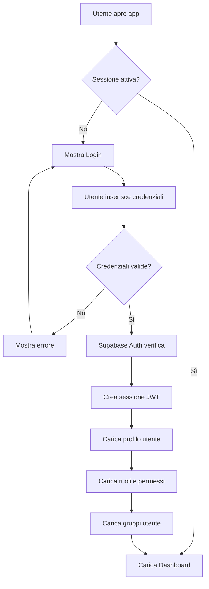

# 🔐 Piano Implementazione Sistema Autenticazione e Autorizzazione

## 📋 Panoramica

Implementazione di un sistema completo di autenticazione utenti con gestione ruoli e controllo accessi basato su gruppi per l'applicazione Travel Business Case.

### Scelte Architetturali
- **Autenticazione**: Supabase Auth (JWT-based, sicuro e professionale)
- **Ruoli**: Sistema flessibile con ruoli personalizzabili
- **Gruppi**: Supporto per gruppi progetto/viaggio E gruppi team/reparto
- **Visibilità**: Gli utenti vedono titolo degli scenari non accessibili ma non i dettagli

---

## 🏗️ Architettura del Sistema

### 1. Schema Database Supabase

#### Tabella: `user_profiles`
Estende la tabella `auth.users` di Supabase con informazioni aggiuntive.

```sql
CREATE TABLE user_profiles (
  id UUID PRIMARY KEY REFERENCES auth.users(id) ON DELETE CASCADE,
  email TEXT NOT NULL UNIQUE,
  full_name TEXT NOT NULL,
  avatar_url TEXT,
  role_id UUID REFERENCES roles(id),
  is_active BOOLEAN DEFAULT true,
  created_at TIMESTAMPTZ DEFAULT NOW(),
  updated_at TIMESTAMPTZ DEFAULT NOW()
);

-- Indici per performance
CREATE INDEX idx_user_profiles_email ON user_profiles(email);
CREATE INDEX idx_user_profiles_role ON user_profiles(role_id);
CREATE INDEX idx_user_profiles_active ON user_profiles(is_active);
```

#### Tabella: `roles`
Definisce i ruoli disponibili nel sistema.

```sql
CREATE TABLE roles (
  id UUID PRIMARY KEY DEFAULT gen_random_uuid(),
  name TEXT NOT NULL UNIQUE,
  display_name TEXT NOT NULL,
  description TEXT,
  permissions JSONB NOT NULL DEFAULT '{}',
  is_system BOOLEAN DEFAULT false, -- Ruoli di sistema non modificabili
  created_at TIMESTAMPTZ DEFAULT NOW(),
  updated_at TIMESTAMPTZ DEFAULT NOW()
);

-- Ruoli predefiniti
INSERT INTO roles (name, display_name, description, permissions, is_system) VALUES
('admin', 'Amministratore', 'Accesso completo al sistema', 
 '{"scenarios": ["create", "read", "update", "delete", "manage_permissions"], 
   "actuals": ["create", "read", "update", "delete", "manage_permissions"],
   "users": ["create", "read", "update", "delete"],
   "groups": ["create", "read", "update", "delete"],
   "roles": ["create", "read", "update", "delete"]}', true),
   
('manager', 'Manager', 'Può creare e gestire scenari/consuntivi e assegnarli a gruppi',
 '{"scenarios": ["create", "read", "update", "delete", "manage_permissions"],
   "actuals": ["create", "read", "update", "delete", "manage_permissions"],
   "groups": ["read"]}', true),
   
('editor', 'Editor', 'Può modificare scenari/consuntivi assegnati',
 '{"scenarios": ["read", "update"],
   "actuals": ["read", "update"]}', true),
   
('viewer', 'Visualizzatore', 'Solo visualizzazione',
 '{"scenarios": ["read"],
   "actuals": ["read"]}', true);
```

#### Tabella: `groups`
Gestisce i gruppi (progetti/viaggi e team/reparti).

```sql
CREATE TABLE groups (
  id UUID PRIMARY KEY DEFAULT gen_random_uuid(),
  name TEXT NOT NULL,
  description TEXT,
  type TEXT NOT NULL CHECK (type IN ('project', 'team')), -- project = viaggio, team = reparto
  color TEXT DEFAULT '#8b5cf6',
  icon TEXT DEFAULT '👥',
  created_by UUID REFERENCES auth.users(id),
  created_at TIMESTAMPTZ DEFAULT NOW(),
  updated_at TIMESTAMPTZ DEFAULT NOW()
);

CREATE INDEX idx_groups_type ON groups(type);
CREATE INDEX idx_groups_created_by ON groups(created_by);
```

#### Tabella: `user_groups`
Associazione molti-a-molti tra utenti e gruppi.

```sql
CREATE TABLE user_groups (
  id UUID PRIMARY KEY DEFAULT gen_random_uuid(),
  user_id UUID NOT NULL REFERENCES auth.users(id) ON DELETE CASCADE,
  group_id UUID NOT NULL REFERENCES groups(id) ON DELETE CASCADE,
  role_in_group TEXT DEFAULT 'member', -- member, leader, admin
  joined_at TIMESTAMPTZ DEFAULT NOW(),
  UNIQUE(user_id, group_id)
);

CREATE INDEX idx_user_groups_user ON user_groups(user_id);
CREATE INDEX idx_user_groups_group ON user_groups(group_id);
```

#### Tabella: `scenario_permissions`
Controllo accessi per scenari (preventivi).

```sql
CREATE TABLE scenario_permissions (
  id UUID PRIMARY KEY DEFAULT gen_random_uuid(),
  scenario_id TEXT NOT NULL, -- ID dello scenario
  group_id UUID REFERENCES groups(id) ON DELETE CASCADE,
  user_id UUID REFERENCES auth.users(id) ON DELETE CASCADE,
  permission_level TEXT NOT NULL CHECK (permission_level IN ('view', 'edit', 'admin')),
  created_at TIMESTAMPTZ DEFAULT NOW(),
  CHECK ((group_id IS NOT NULL AND user_id IS NULL) OR (group_id IS NULL AND user_id IS NOT NULL))
);

CREATE INDEX idx_scenario_permissions_scenario ON scenario_permissions(scenario_id);
CREATE INDEX idx_scenario_permissions_group ON scenario_permissions(group_id);
CREATE INDEX idx_scenario_permissions_user ON scenario_permissions(user_id);
```

#### Tabella: `actual_permissions`
Controllo accessi per consuntivi.

```sql
CREATE TABLE actual_permissions (
  id UUID PRIMARY KEY DEFAULT gen_random_uuid(),
  actual_id TEXT NOT NULL, -- ID del consuntivo
  group_id UUID REFERENCES groups(id) ON DELETE CASCADE,
  user_id UUID REFERENCES auth.users(id) ON DELETE CASCADE,
  permission_level TEXT NOT NULL CHECK (permission_level IN ('view', 'edit', 'admin')),
  created_at TIMESTAMPTZ DEFAULT NOW(),
  CHECK ((group_id IS NOT NULL AND user_id IS NULL) OR (group_id IS NULL AND user_id IS NOT NULL))
);

CREATE INDEX idx_actual_permissions_actual ON actual_permissions(actual_id);
CREATE INDEX idx_actual_permissions_group ON actual_permissions(group_id);
CREATE INDEX idx_actual_permissions_user ON actual_permissions(user_id);
```

#### Tabella: `audit_log`
Log delle azioni per sicurezza e tracciabilità.

```sql
CREATE TABLE audit_log (
  id UUID PRIMARY KEY DEFAULT gen_random_uuid(),
  user_id UUID REFERENCES auth.users(id),
  action TEXT NOT NULL,
  resource_type TEXT NOT NULL,
  resource_id TEXT,
  details JSONB,
  ip_address TEXT,
  user_agent TEXT,
  created_at TIMESTAMPTZ DEFAULT NOW()
);

CREATE INDEX idx_audit_log_user ON audit_log(user_id);
CREATE INDEX idx_audit_log_resource ON audit_log(resource_type, resource_id);
CREATE INDEX idx_audit_log_created ON audit_log(created_at DESC);
```

### 2. Row Level Security (RLS) Policies

```sql
-- Abilita RLS su tutte le tabelle
ALTER TABLE user_profiles ENABLE ROW LEVEL SECURITY;
ALTER TABLE roles ENABLE ROW LEVEL SECURITY;
ALTER TABLE groups ENABLE ROW LEVEL SECURITY;
ALTER TABLE user_groups ENABLE ROW LEVEL SECURITY;
ALTER TABLE scenario_permissions ENABLE ROW LEVEL SECURITY;
ALTER TABLE actual_permissions ENABLE ROW LEVEL SECURITY;

-- Policy per user_profiles
CREATE POLICY "Users can view their own profile"
  ON user_profiles FOR SELECT
  USING (auth.uid() = id);

CREATE POLICY "Admins can view all profiles"
  ON user_profiles FOR SELECT
  USING (
    EXISTS (
      SELECT 1 FROM user_profiles up
      JOIN roles r ON up.role_id = r.id
      WHERE up.id = auth.uid() AND r.name = 'admin'
    )
  );

-- Policy per groups
CREATE POLICY "Users can view groups they belong to"
  ON groups FOR SELECT
  USING (
    EXISTS (
      SELECT 1 FROM user_groups
      WHERE user_groups.group_id = groups.id
      AND user_groups.user_id = auth.uid()
    )
  );

-- Policy per scenario_permissions
CREATE POLICY "Users can view permissions for their scenarios"
  ON scenario_permissions FOR SELECT
  USING (
    user_id = auth.uid() OR
    EXISTS (
      SELECT 1 FROM user_groups
      WHERE user_groups.group_id = scenario_permissions.group_id
      AND user_groups.user_id = auth.uid()
    )
  );
```

---

## 📁 Struttura File JavaScript

### Nuovi File da Creare

```
travel-business-case/js/
├── auth/
│   ├── auth-manager.js          # Gestione autenticazione (login/logout/session)
│   ├── roles-manager.js         # Gestione ruoli e permessi
│   ├── groups-manager.js        # Gestione gruppi
│   ├── permissions-manager.js   # Controllo accessi e autorizzazioni
│   └── user-manager.js          # Gestione utenti (CRUD)
├── ui/
│   ├── login-ui.js              # Interfaccia login/registrazione
│   ├── admin-panel-ui.js        # Pannello amministrazione
│   └── user-profile-ui.js       # Profilo utente
└── middleware/
    └── auth-middleware.js       # Middleware per protezione route
```

### File da Modificare

```
travel-business-case/js/
├── storage.js                   # Aggiungere controlli accesso
├── app.js                       # Integrare autenticazione
├── supabase-storage.js          # Estendere con query filtrate per utente
└── scenarios.js                 # Aggiungere gestione permessi
```

---

## 🔄 Flusso di Autenticazione



---

## 🎯 Logica di Autorizzazione

### Controllo Accesso Scenari/Consuntivi

```javascript
// Pseudocodice logica autorizzazione
function canAccessScenario(userId, scenarioId, action) {
  // 1. Verifica se utente è admin
  if (userRole === 'admin') return true;
  
  // 2. Verifica permessi diretti utente
  const userPermission = getDirectUserPermission(userId, scenarioId);
  if (userPermission && hasPermission(userPermission, action)) return true;
  
  // 3. Verifica permessi tramite gruppi
  const userGroups = getUserGroups(userId);
  for (const group of userGroups) {
    const groupPermission = getGroupPermission(group.id, scenarioId);
    if (groupPermission && hasPermission(groupPermission, action)) return true;
  }
  
  // 4. Nessun permesso trovato
  return false;
}
```

### Livelli di Visibilità

1. **Accesso Completo**: Utente vede e può modificare tutto
2. **Accesso Limitato**: Utente vede titolo ma non dettagli
3. **Nessun Accesso**: Scenario non mostrato in lista

```javascript
function getScenarioVisibility(userId, scenario) {
  const permission = getHighestPermission(userId, scenario.id);
  
  if (!permission) {
    return 'none'; // Non mostrare
  }
  
  if (permission.level === 'view') {
    return 'limited'; // Mostra titolo, blocca dettagli
  }
  
  if (permission.level === 'edit' || permission.level === 'admin') {
    return 'full'; // Accesso completo
  }
}
```

---

## 🎨 Interfaccia Utente

### 1. Schermata Login

```
┌─────────────────────────────────────┐
│   🧳 Business Case Viaggi          │
│                                     │
│   ┌─────────────────────────────┐  │
│   │ 📧 Email                    │  │
│   │ [________________]          │  │
│   │                             │  │
│   │ 🔒 Password                 │  │
│   │ [________________]          │  │
│   │                             │  │
│   │ [ ] Ricordami               │  │
│   │                             │  │
│   │     [🔐 Accedi]             │  │
│   │                             │  │
│   │  Password dimenticata?      │  │
│   └─────────────────────────────┘  │
└─────────────────────────────────────┘
```

### 2. Header con Utente Loggato

```
┌────────────────────────────────────────────────┐
│ 🧳 Business Case Viaggi    [👤 Mario Rossi ▼] │
│                            [🔔] [⚙️] [🚪]      │
└────────────────────────────────────────────────┘
```

### 3. Pannello Amministrazione

```
┌─────────────────────────────────────────────┐
│ ⚙️ Amministrazione                          │
├─────────────────────────────────────────────┤
│ [👥 Utenti] [🎭 Ruoli] [👨‍👩‍👧‍👦 Gruppi]        │
├─────────────────────────────────────────────┤
│                                             │
│ 👥 Gestione Utenti                          │
│ ┌─────────────────────────────────────────┐ │
│ │ Nome          Email         Ruolo       │ │
│ │ Mario Rossi   mario@...    Admin    [⚙️]│ │
│ │ Laura Bianchi laura@...    Manager  [⚙️]│ │
│ │ Paolo Verdi   paolo@...    Viewer   [⚙️]│ │
│ └─────────────────────────────────────────┘ │
│                                             │
│ [➕ Nuovo Utente]                           │
└─────────────────────────────────────────────┘
```

### 4. Assegnazione Permessi Scenario

```
┌─────────────────────────────────────────────┐
│ 🔒 Gestione Accessi - Viaggio Norvegia     │
├─────────────────────────────────────────────┤
│                                             │
│ 👨‍👩‍👧‍👦 Gruppi con Accesso:                    │
│ ┌─────────────────────────────────────────┐ │
│ │ ✓ Team Marketing      [Modifica ▼]     │ │
│ │ ✓ Progetto Norvegia   [Admin ▼]        │ │
│ └─────────────────────────────────────────┘ │
│                                             │
│ 👤 Utenti Individuali:                      │
│ ┌─────────────────────────────────────────┐ │
│ │ ✓ Mario Rossi         [Admin ▼]        │ │
│ └─────────────────────────────────────────┘ │
│                                             │
│ [➕ Aggiungi Gruppo] [➕ Aggiungi Utente]   │
│                                             │
│ [💾 Salva] [❌ Annulla]                     │
└─────────────────────────────────────────────┘
```

---

## 🔧 Implementazione Tecnica

### 1. auth-manager.js - Gestione Autenticazione

```javascript
const AuthManager = {
  currentUser: null,
  currentSession: null,
  
  // Inizializza e verifica sessione
  async init() {
    const { data: { session } } = await supabaseClient.auth.getSession();
    if (session) {
      this.currentSession = session;
      await this.loadUserProfile(session.user.id);
      return true;
    }
    return false;
  },
  
  // Login
  async login(email, password) {
    const { data, error } = await supabaseClient.auth.signInWithPassword({
      email,
      password
    });
    
    if (error) throw error;
    
    this.currentSession = data.session;
    await this.loadUserProfile(data.user.id);
    await this.logAudit('login', 'auth', null);
    
    return data.user;
  },
  
  // Logout
  async logout() {
    await this.logAudit('logout', 'auth', null);
    await supabaseClient.auth.signOut();
    this.currentUser = null;
    this.currentSession = null;
    window.location.reload();
  },
  
  // Carica profilo utente completo
  async loadUserProfile(userId) {
    const { data, error } = await supabaseClient
      .from('user_profiles')
      .select(`
        *,
        role:roles(*)
      `)
      .eq('id', userId)
      .single();
    
    if (error) throw error;
    
    this.currentUser = data;
    await this.loadUserGroups(userId);
    
    return data;
  },
  
  // Carica gruppi utente
  async loadUserGroups(userId) {
    const { data, error } = await supabaseClient
      .from('user_groups')
      .select(`
        *,
        group:groups(*)
      `)
      .eq('user_id', userId);
    
    if (!error && data) {
      this.currentUser.groups = data.map(ug => ug.group);
    }
  },
  
  // Verifica se utente ha permesso
  hasPermission(resource, action) {
    if (!this.currentUser || !this.currentUser.role) return false;
    
    const permissions = this.currentUser.role.permissions;
    return permissions[resource]?.includes(action) || false;
  },
  
  // Log audit
  async logAudit(action, resourceType, resourceId, details = {}) {
    if (!this.currentUser) return;
    
    await supabaseClient.from('audit_log').insert({
      user_id: this.currentUser.id,
      action,
      resource_type: resourceType,
      resource_id: resourceId,
      details,
      created_at: new Date().toISOString()
    });
  }
};
```

### 2. permissions-manager.js - Controllo Accessi

```javascript
const PermissionsManager = {
  
  // Verifica accesso a scenario
  async canAccessScenario(scenarioId, action = 'read') {
    const userId = AuthManager.currentUser?.id;
    if (!userId) return false;
    
    // Admin ha sempre accesso
    if (AuthManager.hasPermission('scenarios', 'manage_permissions')) {
      return true;
    }
    
    // Verifica permessi diretti
    const directPermission = await this.getDirectPermission(
      'scenario', scenarioId, userId
    );
    if (directPermission && this.hasAction(directPermission.permission_level, action)) {
      return true;
    }
    
    // Verifica permessi tramite gruppi
    const userGroups = AuthManager.currentUser.groups || [];
    for (const group of userGroups) {
      const groupPermission = await this.getGroupPermission(
        'scenario', scenarioId, group.id
      );
      if (groupPermission && this.hasAction(groupPermission.permission_level, action)) {
        return true;
      }
    }
    
    return false;
  },
  
  // Ottieni livello permesso più alto
  async getHighestPermission(type, resourceId) {
    const userId = AuthManager.currentUser?.id;
    if (!userId) return null;
    
    const permissions = [];
    
    // Permesso diretto
    const direct = await this.getDirectPermission(type, resourceId, userId);
    if (direct) permissions.push(direct.permission_level);
    
    // Permessi gruppi
    const userGroups = AuthManager.currentUser.groups || [];
    for (const group of userGroups) {
      const groupPerm = await this.getGroupPermission(type, resourceId, group.id);
      if (groupPerm) permissions.push(groupPerm.permission_level);
    }
    
    // Ritorna il più alto: admin > edit > view
    if (permissions.includes('admin')) return 'admin';
    if (permissions.includes('edit')) return 'edit';
    if (permissions.includes('view')) return 'view';
    
    return null;
  },
  
  // Assegna permesso a gruppo
  async assignGroupPermission(type, resourceId, groupId, level) {
    const table = type === 'scenario' ? 'scenario_permissions' : 'actual_permissions';
    const idField = type === 'scenario' ? 'scenario_id' : 'actual_id';
    
    const { data, error } = await supabaseClient
      .from(table)
      .upsert({
        [idField]: resourceId,
        group_id: groupId,
        permission_level: level
      });
    
    if (error) throw error;
    
    await AuthManager.logAudit(
      'assign_permission',
      type,
      resourceId,
      { group_id: groupId, level }
    );
    
    return data;
  },
  
  // Helper: verifica se livello permesso include azione
  hasAction(permissionLevel, action) {
    const levels = {
      'view': ['read'],
      'edit': ['read', 'update'],
      'admin': ['read', 'update', 'delete', 'manage_permissions']
    };
    
    return levels[permissionLevel]?.includes(action) || false;
  }
};
```

### 3. Modifiche a storage.js

```javascript
// Aggiungere filtro per utente corrente
async getScenarios() {
  const data = await this.getData();
  const scenarios = data.scenarios || [];
  
  // Se non autenticato, ritorna array vuoto
  if (!AuthManager.currentUser) {
    return [];
  }
  
  // Filtra scenari in base ai permessi
  const accessibleScenarios = [];
  for (const scenario of scenarios) {
    const permission = await PermissionsManager.getHighestPermission(
      'scenario',
      scenario.id
    );
    
    if (permission) {
      // Aggiungi metadati permesso
      scenario._permission = permission;
      scenario._canEdit = ['edit', 'admin'].includes(permission);
      scenario._canDelete = permission === 'admin';
      accessibleScenarios.push(scenario);
    }
  }
  
  return accessibleScenarios;
},

// Verifica permessi prima di salvare
async updateScenario(id, updates) {
  const canEdit = await PermissionsManager.canAccessScenario(id, 'update');
  if (!canEdit) {
    throw new Error('Permesso negato: non puoi modificare questo scenario');
  }
  
  // ... resto del codice esistente
}
```

---

## 📝 Checklist Implementazione

### Fase 1: Setup Database (Priorità Alta)
- [ ] Creare tabelle Supabase
- [ ] Configurare RLS policies
- [ ] Inserire ruoli predefiniti
- [ ] Testare connessione e query

### Fase 2: Autenticazione Base (Priorità Alta)
- [ ] Implementare auth-manager.js
- [ ] Creare UI login/logout
- [ ] Gestire sessioni JWT
- [ ] Implementare redirect automatico

### Fase 3: Sistema Permessi (Priorità Alta)
- [ ] Implementare permissions-manager.js
- [ ] Modificare storage.js con filtri
- [ ] Aggiungere controlli in app.js
- [ ] Testare accessi con diversi ruoli

### Fase 4: Gestione Gruppi (Priorità Media)
- [ ] Implementare groups-manager.js
- [ ] Creare UI gestione gruppi
- [ ] Implementare assegnazione utenti a gruppi
- [ ] Testare permessi tramite gruppi

### Fase 5: Pannello Admin (Priorità Media)
- [ ] Creare admin-panel-ui.js
- [ ] Implementare CRUD utenti
- [ ] Implementare gestione ruoli
- [ ] Implementare assegnazione permessi

### Fase 6: UI Avanzata (Priorità Bassa)
- [ ] Profilo utente
- [ ] Cambio password
- [ ] Reset password via email
- [ ] Notifiche permessi

### Fase 7: Testing e Documentazione (Priorità Alta)
- [ ] Test con ruolo Admin
- [ ] Test con ruolo Manager
- [ ] Test con ruolo Viewer
- [ ] Documentazione utente
- [ ] Guida amministratore

---

## 🔄 Migrazione Dati Esistenti

### Script Migrazione

```javascript
// Script per assegnare tutti gli scenari esistenti all'admin
async function migrateExistingData() {
  // 1. Ottieni primo admin
  const { data: admin } = await supabaseClient
    .from('user_profiles')
    .select('id')
    .eq('role.name', 'admin')
    .limit(1)
    .single();
  
  if (!admin) {
    console.error('Nessun admin trovato!');
    return;
  }
  
  // 2. Ottieni tutti gli scenari
  const scenarios = await StorageManager.getScenarios();
  
  // 3. Assegna permessi admin a tutti gli scenari
  for (const scenario of scenarios) {
    await PermissionsManager.assignUserPermission(
      'scenario',
      scenario.id,
      admin.id,
      'admin'
    );
  }
  
  // 4. Ripeti per consuntivi
  const actuals = await StorageManager.getActuals();
  for (const actual of actuals) {
    await PermissionsManager.assignUserPermission(
      'actual',
      actual.id,
      admin.id,
      'admin'
    );
  }
  
  console.log('✅ Migrazione completata!');
}
```

---

## 🎯 Vantaggi del Sistema

### Sicurezza
- ✅ Autenticazione JWT sicura tramite Supabase
- ✅ Password hashate automaticamente
- ✅ Row Level Security a livello database
- ✅ Audit log completo delle azioni

### Flessibilità
- ✅ Ruoli personalizzabili
- ✅ Permessi granulari (view/edit/admin)
- ✅ Gruppi multipli per utente
- ✅ Assegnazione permessi a utenti O gruppi

### Scalabilità
- ✅ Supporta migliaia di utenti
- ✅ Performance ottimizzate con indici
- ✅ Cache locale per velocità
- ✅ Sincronizzazione automatica

### User Experience
- ✅ Login semplice e veloce
- ✅ Sessioni persistenti
- ✅ UI intuitiva per gestione permessi
- ✅ Visibilità chiara degli accessi

---

## 📚 Documentazione Aggiuntiva da Creare

1. **GUIDA_AMMINISTRATORE.md** - Come gestire utenti e permessi
2. **GUIDA_UTENTE_AUTH.md** - Come usare il sistema di login
3. **API_REFERENCE_AUTH.md** - Documentazione API autenticazione
4. **TROUBLESHOOTING_AUTH.md** - Risoluzione problemi comuni

---

## 🚀 Prossimi Passi

1. **Revisione Piano**: Conferma che il piano soddisfi tutti i requisiti
2. **Setup Database**: Creare le tabelle su Supabase
3. **Implementazione**: Seguire la checklist fase per fase
4. **Testing**: Verificare ogni funzionalità
5. **Documentazione**: Creare guide utente

---

**Versione Piano**: 1.0  
**Data**: 29 Maggio 2026  
**Autore**: Bob (AI Planning Assistant)